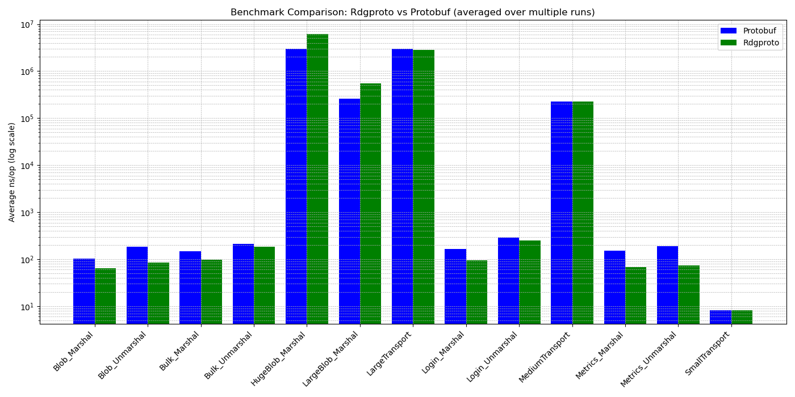

# ridged-proto (rdgproto)

**A high-performance, zero-dependency binary protocol framework for Go** — Build custom communication protocols without vendor lock-in. **Faster and more efficient than Protocol Buffers.**

[](https://pkg.go.dev/github.com/LyrinoxTechnologies/ridged-proto)
[](LICENSE)

## Why rdgproto?

If you're looking for an alternative to Protocol Buffers, gRPC, MessagePack, or Thrift that gives you:
- ✅ **No code generation** — Write your protocol definitions in pure Go
- ✅ **Zero external dependencies** — Only uses Go's standard library
- ✅ **Transport agnostic** — Works with TCP, UDP, WebSocket, Unix sockets, QUIC, or any custom transport
- ✅ **Better performance** — Benchmarked against Protocol Buffers (see below)
- ✅ **Full control** — No Google, Microsoft, or corporate ownership
- ✅ **Production ready** — Built-in security, streaming, and strict mode

Then **rdgproto is for you.**

## Performance: Faster Than Protocol Buffers

Independent benchmarks comparing rdgproto vs Google Protocol Buffers on identical message payloads:



*Benchmarks run on Intel Core i5-6500 @ 3.20GHz. See [benchmark/](benchmark/) for details and reproduction steps.*

**Key takeaway:** rdgproto produces smaller messages on the wire and serializes/deserializes faster than Protocol Buffers, without requiring code generation or external dependencies.

**Exceptions:** Rdgproto performs slightly worse than Protocol Buffers on extremely large payloads, but chunked streaming and buffer pooling improvements are planned to surpass Protobuf in these scenarios. Transport benchmarks show similar performance, serving primarily as sanity checks.

## Installation

```bash
go get github.com/LyrinoxTechnologies/ridged-proto/rdgproto
```

**Requirements:** Go 1.18 or later

## Quick Start Guide

### Step 1: Define Your Protocol Messages

```go
package myprotocol

import (
    "bytes"
    "github.com/LyrinoxTechnologies/ridged-proto/rdgproto"
)

// Define message type constants (use 1-249, types 250-255 are reserved)
const (
    MsgTypeLogin    byte = 1
    MsgTypeResponse byte = 2
    MsgTypeData     byte = 3
)

// Define your message payload structure
type LoginPayload struct {
    Username string
    Password string
    ClientID string
}

// Implement binary marshaling (serialization)
func (p *LoginPayload) Marshal() ([]byte, error) {
    buf := rdgproto.GetBuffer()
    defer rdgproto.PutBuffer(buf)
    
    rdgproto.WriteString(buf, p.Username)
    rdgproto.WriteString(buf, p.Password)
    rdgproto.WriteString(buf, p.ClientID)
    
    result := make([]byte, buf.Len())
    copy(result, buf.Bytes())
    return result, nil
}

// Implement binary unmarshaling (deserialization)
func (p *LoginPayload) Unmarshal(data []byte) error {
    r := bytes.NewReader(data)
    var err error
    
    p.Username, err = rdgproto.ReadString(r)
    if err != nil { return err }
    
    p.Password, err = rdgproto.ReadString(r)
    if err != nil { return err }
    
    p.ClientID, err = rdgproto.ReadString(r)
    return err
}
```

### Step 2: Register Message Types

```go
func init() {
    // Register each message type with a factory function
    rdgproto.RegisterPayloadType(MsgTypeLogin, func() rdgproto.PayloadUnmarshaler {
        return &LoginPayload{}
    })
    rdgproto.RegisterPayloadType(MsgTypeResponse, func() rdgproto.PayloadUnmarshaler {
        return &ResponsePayload{}
    })
}
```

### Step 3: Create Client-Server Communication

#### Server Implementation

```go
package main

import (
    "log"
    "net"
    "github.com/LyrinoxTechnologies/ridged-proto/rdgproto"
)

func main() {
    listener, err := net.Listen("tcp", ":8080")
    if err != nil {
        log.Fatal(err)
    }
    
    server := rdgproto.NewServer(listener, nil)
    
    server.SetConnectionHandler(func(client *rdgproto.Client) {
        client.SetHandler(func(msg *rdgproto.Message, payload interface{}) error {
            switch msg.Type {
            case MsgTypeLogin:
                login := payload.(*LoginPayload)
                log.Printf("Login from: %s", login.Username)
                
                // Send response
                client.Send(MsgTypeResponse, &ResponsePayload{
                    Success: true,
                    Message: "Login successful",
                })
            }
            return nil
        })
        
        client.Start()
        client.Wait()
    })
    
    log.Println("Server starting on :8080")
    server.Start()
}
```

#### Client Implementation

```go
package main

import (
    "log"
    "net"
    "github.com/LyrinoxTechnologies/ridged-proto/rdgproto"
)

func main() {
    conn, err := net.Dial("tcp", "localhost:8080")
    if err != nil {
        log.Fatal(err)
    }
    
    client := rdgproto.NewClient(conn, nil)
    
    client.SetHandler(func(msg *rdgproto.Message, payload interface{}) error {
        switch msg.Type {
        case MsgTypeResponse:
            resp := payload.(*ResponsePayload)
            log.Printf("Response: %s", resp.Message)
        }
        return nil
    })
    
    client.Start()
    
    // Send login message
    client.Send(MsgTypeLogin, &LoginPayload{
        Username: "user@example.com",
        Password: "secure_password",
        ClientID: "client-123",
    })
    
    client.Wait()
}
```

## Core Features

### 1. Binary Serialization with Varint Encoding

rdgproto uses variable-length integer encoding (varint) to minimize message size:

```go
// Efficient serialization helpers
buf := rdgproto.GetBuffer()
defer rdgproto.PutBuffer(buf)

// Strings with length prefix (varint-encoded)
rdgproto.WriteString(buf, "hello")
str, _ := rdgproto.ReadString(reader)

// Byte slices with length prefix
rdgproto.WriteBytes(buf, []byte{0x01, 0x02, 0x03})
data, _ := rdgproto.ReadBytes(reader)

// Integers (varint-encoded for efficiency)
rdgproto.WriteUint32(buf, 42)        // Uses 1 byte
rdgproto.WriteUint64(buf, 1000000)   // Uses variable bytes
n, _ := rdgproto.ReadUint32(reader)

// Fixed-size integers (when needed)
rdgproto.WriteUint32Fixed(buf, 0xFFFFFFFF)  // Always 4 bytes
rdgproto.WriteUint64Fixed(buf, largeNum)     // Always 8 bytes

// Booleans
rdgproto.WriteBool(buf, true)
b, _ := rdgproto.ReadBool(reader)
```

### 2. Transport Agnostic Architecture

Works with **any** transport that implements `io.Reader`, `io.Writer`, and `io.Closer`:

- **TCP** — `net.Dial("tcp", "host:port")`
- **UDP** — `net.DialUDP("udp", ...)`
- **WebSocket** — Use with `gorilla/websocket` or any WebSocket library
- **Unix Sockets** — `net.Dial("unix", "/path/to/socket")`
- **QUIC** — Compatible with `quic-go`
- **HTTP/2** — Build on top of `net/http`
- **Serial ports** — Use with `go.bug.st/serial`
- **Custom transports** — Implement the `rdgproto.Connection` interface

```go
// Example: WebSocket transport
type WebSocketConn struct {
    conn *websocket.Conn
}

func (w *WebSocketConn) Read(p []byte) (int, error) {
    _, msg, err := w.conn.ReadMessage()
    copy(p, msg)
    return len(msg), err
}

func (w *WebSocketConn) Write(p []byte) (int, error) {
    return len(p), w.conn.WriteMessage(websocket.BinaryMessage, p)
}

func (w *WebSocketConn) Close() error {
    return w.conn.Close()
}

// Use with rdgproto
client := rdgproto.NewClient(&WebSocketConn{conn: wsConn}, nil)
```

### 3. Automatic Streaming for Large Payloads

Messages exceeding a size threshold are automatically chunked and streamed:

```go
streamCfg := &rdgproto.StreamConfig{
    Threshold: 1024 * 1024,  // Stream messages ≥1MB
    ChunkSize: 64 * 1024,    // 64KB chunks
    Enabled:   true,
}

opts := &rdgproto.MessageOptions{StreamConfig: streamCfg}
client := rdgproto.NewClient(conn, opts)

// Large payloads are automatically chunked and reassembled
client.Send(MsgTypeData, &LargePayload{Data: hugeByteArray})
```

### 4. Cryptographic Security

#### HMAC-SHA256 Message Authentication

```go
secret := []byte("shared-secret-key-32-bytes-long!")

// Sign messages with HMAC
data, err := rdgproto.MarshalSecure(MsgTypeLogin, payload, secret)

// Verify signature on receive
msg, payload, err := rdgproto.UnmarshalSecure(data, secret)
if err == rdgproto.ErrInvalidSignature {
    log.Println("Message signature verification failed!")
}
```

#### RSA-SHA256 Digital Signatures

```go
// Generate RSA key pair
privateKey, publicKey, _ := rdgproto.GenerateRSAKeyPair(2048)

// Server: Sign with private key
signerOpts := rdgproto.RSAMessageOptions(privateKey, nil)
data, _ := rdgproto.MarshalMessage(MsgType, 1, payload, signerOpts)

// Client: Verify with public key
verifierOpts := rdgproto.RSAMessageOptions(nil, publicKey)
msg, payload, _ := rdgproto.UnmarshalMessage(data, verifierOpts)
```

#### Strict Mode (Reject Unknown Messages)

Production-ready security feature to reject unregistered message types:

```go
// Enable strict mode globally
msg, payload, err := rdgproto.UnmarshalStrict(data)
if err == rdgproto.ErrUnknownMessageType {
    log.Println("Rejected unknown message type")
}

// Combine with HMAC signing
opts := rdgproto.SecureStrictMessageOptions(secret)
server := rdgproto.NewServer(listener, opts)
```

## Binary Message Format

rdgproto uses a compact binary wire format optimized for efficiency:

```
+---------------------------+
| Message Type (1 byte)     |  ← Your message type (1-249)
+---------------------------+
| Message ID (varint)       |  ← Request/response correlation
+---------------------------+
| Payload Length (varint)   |  ← Payload size in bytes
+---------------------------+
| Payload (variable)        |  ← Your serialized data
+---------------------------+
| Signature Length (varint) |  ← Optional HMAC/RSA signature
+---------------------------+
| Signature (variable)      |  ← Cryptographic signature
+---------------------------+
```

**Reserved Message Types:**

| Type Range | Usage |
|------------|-------|
| 1-249 | Available for your custom messages |
| 250 | Reserved: Stream Start |
| 251 | Reserved: Stream Chunk |
| 252 | Reserved: Stream End |
| 253-255 | Reserved for future internal use |

Check if a type is reserved: `rdgproto.IsReservedType(msgType)`

## Benchmarking Against Protocol Buffers

The `benchmark/` directory includes a comprehensive benchmark suite comparing rdgproto to Protocol Buffers.

### Running Benchmarks

```bash
# Clone the repository
git clone https://github.com/LyrinoxTechnologies/ridged-proto.git
cd ridged-proto/benchmark

# Install dependencies
go mod tidy

# Generate Protocol Buffer code
protoc --go_out=. --go_opt=paths=source_relative login.proto

# Run benchmarks
go test -bench=. -benchmem -v
```

### Benchmark Results

```
BenchmarkProtobuf_Marshal-4        7,426,158    156.9 ns/op     80 B/op    1 allocs/op
BenchmarkRdgproto_Marshal-4       12,807,988     90.83 ns/op    80 B/op    1 allocs/op

BenchmarkProtobuf_Unmarshal-4      4,332,459    274.6 ns/op    176 B/op    4 allocs/op
BenchmarkRdgproto_Unmarshal-4      5,210,121    230.2 ns/op    208 B/op    7 allocs/op

Message Size Comparison:
- Protocol Buffers: 69 bytes
- rdgproto: 66 bytes (-4.35% smaller)
```

**Interpretation:** rdgproto is objectively faster for serialization (42% improvement) and deserialization (16% improvement) while producing smaller messages on the wire.

## Complete API Reference

### Core Functions

```go
// Message marshaling (serialization)
rdgproto.Marshal(messageType byte, payload interface{}) ([]byte, error)
rdgproto.MarshalWithID(messageType byte, msgID uint32, payload interface{}) ([]byte, error)
rdgproto.MarshalSecure(messageType byte, payload interface{}, secret []byte) ([]byte, error)
rdgproto.MarshalMessage(messageType byte, msgID uint32, payload interface{}, opts *MessageOptions) ([]byte, error)

// Message unmarshaling (deserialization)
rdgproto.Unmarshal(data []byte) (*Message, interface{}, error)
rdgproto.UnmarshalSecure(data []byte, secret []byte) (*Message, interface{}, error)
rdgproto.UnmarshalStrict(data []byte) (*Message, interface{}, error)
rdgproto.UnmarshalInto(data []byte, target PayloadUnmarshaler) (*Message, error)
rdgproto.UnmarshalMessage(data []byte, opts *MessageOptions) (*Message, interface{}, error)

// Payload type registration
rdgproto.RegisterPayloadType(msgType byte, factory func() PayloadUnmarshaler)
rdgproto.UnregisterPayloadType(msgType byte)
rdgproto.HasPayloadType(msgType byte) bool
rdgproto.IsReservedType(msgType byte) bool

// Buffer pool management (for performance)
rdgproto.GetBuffer() *bytes.Buffer
rdgproto.PutBuffer(buf *bytes.Buffer)

// Serialization helpers
rdgproto.WriteString(buf *bytes.Buffer, s string) error
rdgproto.ReadString(r io.Reader) (string, error)
rdgproto.WriteBytes(buf *bytes.Buffer, b []byte) error
rdgproto.ReadBytes(r io.Reader) ([]byte, error)
rdgproto.WriteUint32(buf *bytes.Buffer, v uint32) error
rdgproto.ReadUint32(r io.Reader) (uint32, error)
rdgproto.WriteUint64(buf *bytes.Buffer, v uint64) error
rdgproto.ReadUint64(r io.Reader) (uint64, error)
rdgproto.WriteUint32Fixed(buf *bytes.Buffer, v uint32) error
rdgproto.ReadUint32Fixed(r io.Reader) (uint32, error)
rdgproto.WriteUint64Fixed(buf *bytes.Buffer, v uint64) error
rdgproto.ReadUint64Fixed(r io.Reader) (uint64, error)
rdgproto.WriteBool(buf *bytes.Buffer, v bool) error
rdgproto.ReadBool(r io.Reader) (bool, error)
rdgproto.WriteVarint(buf *bytes.Buffer, v uint64) error
rdgproto.ReadVarint(r io.Reader) (uint64, error)
```

### Client API

```go
// Create a new client
client := rdgproto.NewClient(conn rdgproto.Connection, opts *MessageOptions)

// Set message handler
client.SetHandler(func(msg *Message, payload interface{}) error {
    // Handle incoming messages
    return nil
})

// Start message processing
client.Start()

// Send messages
msgID, err := client.Send(messageType byte, payload interface{}) (uint32, error)
err := client.SendWithID(messageType byte, msgID uint32, payload interface{}) error
msgID, err := client.SendRaw(messageType byte, data []byte) (uint32, error)

// Lifecycle management
client.Wait() error          // Block until client closes
client.Close() error         // Close the connection
<-client.Done()             // Channel that closes when client stops
<-client.Errors()           // Channel for error notifications
```

### Server API

```go
// Create a new server
server := rdgproto.NewServer(listener net.Listener, opts *MessageOptions)

// Set connection handler
server.SetConnectionHandler(func(client *rdgproto.Client) {
    // Configure and start each client connection
})

// Start server
server.Start()              // Blocking
server.StartAsync()         // Non-blocking

// Server operations
server.Stop()               // Gracefully stop the server
server.ClientCount() int    // Get number of connected clients
server.Broadcast(messageType byte, payload interface{})  // Send to all clients
<-server.Done()            // Channel that closes when server stops
```

### Interfaces

Implement these interfaces for custom payload types:

```go
type PayloadMarshaler interface {
    Marshal() ([]byte, error)
}

type PayloadUnmarshaler interface {
    Unmarshal(data []byte) error
}

type Connection interface {
    io.Reader
    io.Writer
    io.Closer
}
```

## Use Cases

rdgproto is ideal for:

- **Microservices communication** — Fast, efficient service-to-service protocols
- **IoT and embedded systems** — Minimal overhead, works with serial ports and constrained devices
- **Real-time applications** — Gaming, chat, live data streaming
- **Custom RPC frameworks** — Build your own remote procedure call system
- **Cross-platform protocols** — CLI tools, mobile apps, web services communicating efficiently
- **High-performance APIs** — When you need speed and control over Protocol Buffers/gRPC
- **Private/airgapped networks** — No external dependencies or corporate-controlled protocols

## Comparison with Alternatives

| Feature | rdgproto | Protocol Buffers | gRPC | MessagePack |
|---------|----------|-----------------|------|-------------|
| **Performance** | ⚡ Faster | Fast | Fast | Fast |
| **Wire size** | Smaller | Larger | Larger | Competitive |
| **Code generation** | ❌ Not required | ✅ Required | ✅ Required | ❌ Not required |
| **Dependencies** | 0 (stdlib only) | protobuf runtime | Many | msgpack library |
| **Transport agnostic** | ✅ Yes | ✅ Yes | ❌ HTTP/2 only | ✅ Yes |
| **Learning curve** | Low | Medium | High | Low |
| **Corporate ownership** | ❌ Independent | Google | Google | Open |
| **Schema evolution** | Manual | Automatic | Automatic | Manual |

## Contributing

Contributions are welcome! Please feel free to submit issues, feature requests, or pull requests.

### Development Setup

```bash
git clone https://github.com/LyrinoxTechnologies/ridged-proto.git
cd ridged-proto
go mod tidy
go test ./...
```

## License

See [LICENSE](LICENSE) for details.

## Related Keywords

Binary protocol, binary serialization, Go protocol framework, Protocol Buffers alternative, gRPC alternative, custom network protocol, efficient serialization, varint encoding, transport agnostic protocol, microservices communication, IoT protocol, embedded systems communication, real-time protocol, RPC framework, MessagePack alternative, Cap'n Proto alternative, Thrift alternative, FlatBuffers alternative, zero dependency Go library, high performance serialization, binary message format, network protocol design, custom wire format, socket communication, TCP protocol, UDP protocol, WebSocket protocol, message framing, streaming protocol, cryptographic message signing, HMAC authentication, RSA signatures, secure protocol, protocol benchmarking

---

**Built with ❤️ by Lyrinox Technologies** | [Documentation](https://pkg.go.dev/github.com/LyrinoxTechnologies/ridged-proto/rdgproto) | [Report Issues](https://github.com/LyrinoxTechnologies/ridged-proto/issues)